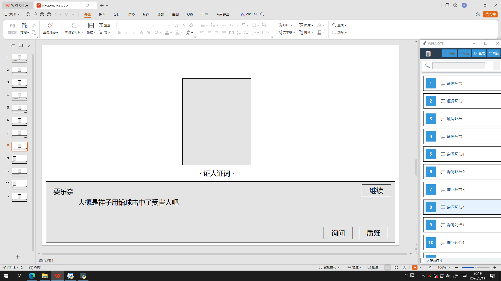

# wps_ppt_assistant
WPS的PPT插件，分为原版和增强版，原版不再改动，增强版有新想法会更新
### 目录视图（主要功能）
- 视图构成：幻灯片序号 | 幻灯片备注
- 诞生由来：自带的大纲视图取决于标题文本框，实际本人操作中是图片+大量文本（不含标题），大纲视图无法作为目录参考，备注不会影响幻灯片内容很合适，但是没有列表视图，因此有了此程序
- 使用场景：超链接设置选择幻灯片序号的时候方便快速定位
### 其他功能
- 快捷更改备注：双击备注内容，点击“保存”按钮，将更改该幻灯片备注
- 快速定位：单击备注内容可切换文档当前幻灯片
- 关键词搜索：筛选备注符合条件的幻灯片
- 快捷复制：单击备注内容可单独选中，可使用ctrl或shift多选，点击“生成”按钮，选中的幻灯片将粘贴在文档幻灯片末尾
- （未实现/计划实现功能，批量移动：选择多个幻灯片更改位置，根据相对位置排序）
### 运行图片

